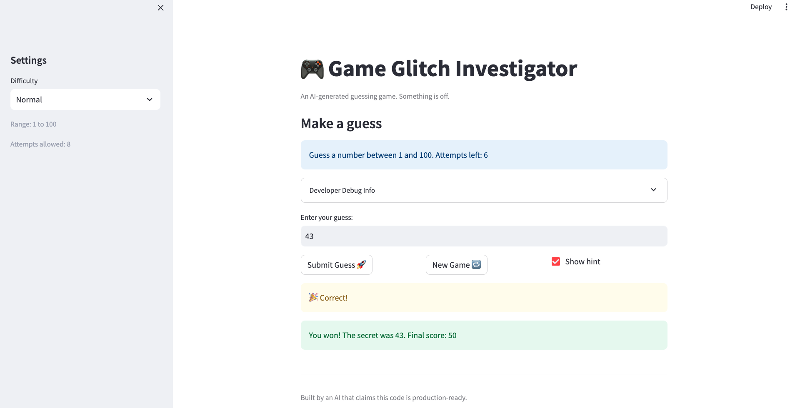

# 🎮 Game Glitch Investigator: The Impossible Guesser

## 🚨 The Situation

You asked an AI to build a simple "Number Guessing Game" using Streamlit.
It wrote the code, ran away, and now the game is unplayable.

- You can't win.
- The hints lie to you.
- The secret number seems to have commitment issues.

## 🛠️ Setup

1. Install dependencies: `pip install -r requirements.txt`
2. Run the broken app: `python -m streamlit run app.py`

## 🕵️‍♂️ Your Mission

1. **Play the game.** Open the "Developer Debug Info" tab in the app to see the secret number. Try to win.
2. **Find the State Bug.** Why does the secret number change every time you click "Submit"? Ask ChatGPT: _"How do I keep a variable from resetting in Streamlit when I click a button?"_
3. **Fix the Logic.** The hints ("Higher/Lower") are wrong. Fix them.
4. **Refactor & Test.** - Move the logic into `logic_utils.py`.
   - Run `pytest` in your terminal.
   - Keep fixing until all tests pass!

## 📝 Document Your Experience

Game Purpose

The purpose of this game is to create a number guessing game where the player tries to guess a secret number within a limited number of attempts. After each guess, the game provides hints indicating whether the guess is too high or too low. The difficulty level controls the guessing range and the number of attempts allowed.

Bugs I Found

While testing the game, I discovered several issues:

The attempts counter showed one fewer attempt than allowed because the attempts variable started at 1 instead of 0.

Hard difficulty originally used a smaller number range than Normal difficulty, making the game easier instead of harder.

The hint messages were reversed. When the guess was higher than the secret number, the game told the player to go higher instead of lower.

When starting a new game, the secret number was generated using a hardcoded range 1–100 instead of using the selected difficulty range.

Fixes Applied

To fix these problems, I made the following changes:

Initialized attempts to 0 so the attempts counter starts correctly.

Updated the Hard difficulty range so it is larger than the Normal difficulty range.

Corrected the logic in check_guess() so the hints properly indicate whether the guess is too high or too low.

Updated the new game logic to generate the secret number using the selected difficulty range (low to high) instead of a hardcoded value.

Refactored the game logic into logic_utils.py and added regression tests to verify the fixes using pytest.

## 📸 Demo

Here is a screenshot of the fixed game where the player wins successfully.

